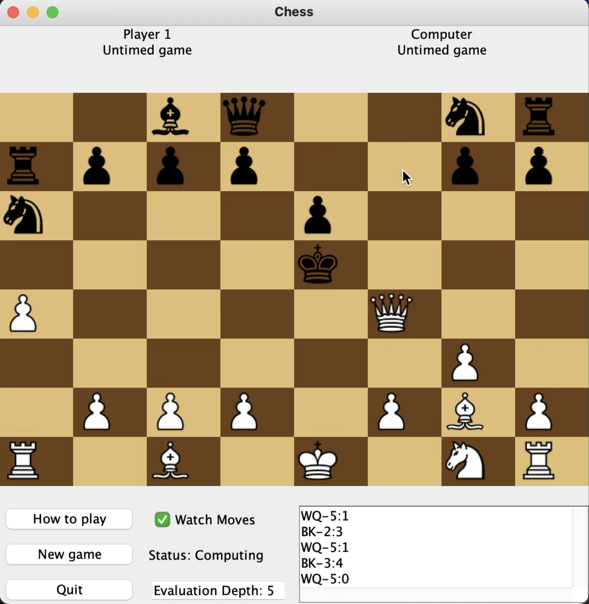

# ChessAI using MiniMax with Alpha Beta Pruning

ChessAI is java based implementing the Minimax algorithm with Alpha-Beta Pruning.

## Solution

I added alpha beta pruning to this. It runs in under 3 minutes for a depth evaluation of 5. `Board.java` contains the alpha and beta pruning implementation.

## Video Demonstration

## Usage

You can run the `Game.java` file to see the program in action but you must have javafx installed in your environemnt.
